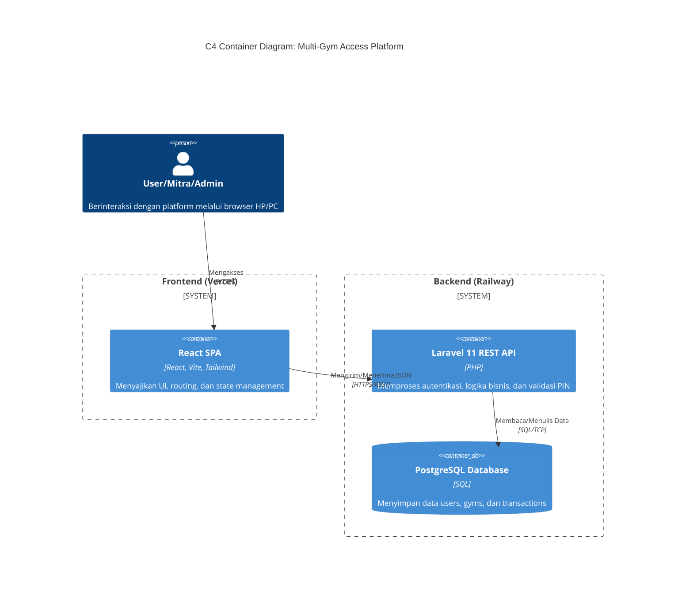

# ARCHITECTURE.MD
**Project:** Multi-Gym Access Platform (MVP)
**Architecture Type:** Decoupled SPA & RESTful API

## 1. Definisi Tech Stack Lengkap & Modern (2026)

Meninggalkan pendekatan monolitik tradisional (seperti Blade), arsitektur ini dibangun dengan pemisahan tegas antara antarmuka pengguna (UI) dan logika bisnis (*backend*).

### A. Frontend (Client-Side)
*   **Core Library:** **React.js** (versi stabil terbaru) berjalan sebagai *Single Page Application* (SPA).
*   **Build Tool:** **Vite** untuk *Hot Module Replacement* (HMR) yang instan dan *bundling* yang ringan.
*   **State Management:** **Zustand** untuk mengelola *global state* ringan seperti profil *user* yang sedang *login* dan *role* yang aktif.
*   **Routing:** **TanStack Router** untuk keamanan *type-safe routing* dan navigasi yang mulus antar *dashboard* peran.
*   **Data Fetching & Caching:** **TanStack Query (React Query v5)** untuk sinkronisasi data dari API, *caching*, dan penanganan *loading/error state* tanpa banyak kode *boilerplate*.
*   **Styling:** **Tailwind CSS** untuk implementasi *utility-first styling* yang *mobile-friendly*.
*   **Validasi Form:** **React Hook Form** dipadukan dengan **Zod** untuk validasi *schema* sebelum data dikirim ke API.

### B. Backend (API & Business Logic)
*   **Framework:** **Laravel 11 (API Only Mode)**. Laravel akan difungsikan murni sebagai penyedia RESTful API berformat JSON, memproses logika sistem kredit, dan memastikan prinsip ACID pada transaksi.
*   **Authentication:** **Laravel Sanctum** untuk menerbitkan dan mengelola API Token bagi ketiga *role* pengguna (Admin, Mitra, User).

### C. Database
*   **Sistem Manajemen:** **PostgreSQL 16+**. Digunakan untuk integritas data transaksional pada sistem *ledger* dompet internal, yang mencakup tabel `users`, `gyms`, dan `transactions`.

### D. Hosting, Infrastruktur, & CI/CD
*   **Frontend Deployment:** **Vercel** (Terhubung langsung ke repositori GitHub untuk *auto-deploy* setiap kali ada *push* ke *branch* `main`).
*   **Backend & DB Deployment:** **Railway** (Menyediakan *provisioning* otomatis untuk PostgreSQL dan *environment* PHP/Laravel yang sangat cepat).
*   **CI/CD Pipeline:** **GitHub Actions** untuk menjalankan otomatisasi *testing* dan *linting* sebelum kode digabungkan (*merge*).

### E. Tools Pendukung
*   **Testing:** **Vitest** (Unit Testing) dan **Playwright** (End-to-End Testing).
*   **Linting & Formatting:** **ESLint** (Flat Config) dan **Prettier**.

---

## 2. Arsitektur Sistem & Alur Data

Berikut adalah *C4 Container Diagram* yang menggambarkan bagaimana *Frontend* bereaksi secara independen dan berkomunikasi dengan *Backend* melalui HTTPS.

---

## 3. Struktur Implementasi Modular (Work Breakdown Structure)

Implementasi dibagi menjadi 4 fase agar dapat dieksekusi dengan aman dalam batas waktu 12 hari. 

### FASE 1: Setup Infrastruktur & Autentikasi (Hari 1-3)
**Deskripsi Tugas:** Inisialisasi repositori, konfigurasi CI/CD, setup *database*, dan pembuatan sistem *login/register* yang mengeluarkan API Token berdasarkan peran.

*   **Komponen Teknis (React):**
    *   `src/pages/Login.tsx`, `src/pages/Register.tsx`
    *   `src/store/authStore.ts` (Zustand untuk simpan token & data *user*).
    *   `src/components/ProtectedRoute.tsx` (Mencegah akses jika tidak memiliki *role* yang sesuai).
*   **Komponen Teknis (API & DB):**
    *   API: `POST /api/auth/register`, `POST /api/auth/login`, `GET /api/user`
    *   Tabel: `users`.
*   **Kriteria Selesai (DoD):**
    *   Aplikasi *Frontend* (Vercel) dan *Backend* (Railway) berhasil ter-*deploy*.
    *   Endpoint API menerima *payload* JSON dan memvalidasi *request* (mengembalikan 422 jika gagal, 200/201 jika sukses).
    *   *User* berhasil *login*, token tersimpan di *Client* (HTTP-only cookie/localStorage), dan *router* mengarahkan *user* ke *dashboard* masing-masing *role*.

### FASE 2: Manajemen Katalog Gym (Hari 4-6)
**Deskripsi Tugas:** Membangun fitur CRUD untuk Admin agar dapat menambahkan Mitra gym, serta membangun halaman direktori untuk *User* agar bisa melihat daftar gym dan harga kreditnya.

*   **Komponen Teknis (React):**
    *   `src/pages/admin/GymManager.tsx`, `src/components/forms/GymForm.tsx`
    *   `src/pages/user/GymDiscovery.tsx`, `src/components/cards/GymCard.tsx`
*   **Komponen Teknis (API & DB):**
    *   API: `GET /api/gyms`, `POST /api/gyms` (Admin only), `PUT /api/gyms/{id}`, `DELETE /api/gyms/{id}`
    *   Tabel: `gyms`.
*   **Kriteria Selesai (DoD):**
    *   Data gym berhasil diambil menggunakan `useQuery` (TanStack Query) dengan penanganan *loading state* (skeleton UI).
    *   Daftar gym tampil secara responsif (Grid di Desktop, Stack di Mobile).
    *   Admin berhasil menambah gym baru dengan harga kredit (*credit_price*) terekam di tabel `gyms`.

### FASE 3: Core Transaksi & Sistem Check-in (Hari 7-9)
**Deskripsi Tugas:** Membangun antarmuka bagi *User* untuk menekan tombol *check-in*, menampilkan peringatan pemotongan kredit, menyimpan transaksi dengan status *pending*, dan menghasilkan PIN 4-digit (*Time-To-Live*).

*   **Komponen Teknis (React):**
    *   `src/pages/user/GymDetail.tsx`
    *   `src/components/modals/CheckInConfirmModal.tsx`
    *   `src/components/ui/PinDisplay.tsx`
*   **Komponen Teknis (API & DB):**
    *   API: `POST /api/transactions/checkin`
    *   Tabel: `transactions`.
*   **Kriteria Selesai (DoD):**
    *   *Endpoint* API mengunci transaksi dan menghasilkan kode PIN unik, menetapkan *status* `pending`, serta mengatur `expires_at`.
    *   UI menampilkan PIN secara mencolok (berukuran besar) dan memberikan hitung mundur (*countdown*) sisa waktu berlakunya PIN.
    *   Unit test memastikan PIN tidak ter-*generate* jika saldo kredit *user* tidak mencukupi.

### FASE 4: Validasi PIN & Settlement Dompet (Hari 10-12)
**Deskripsi Tugas:** Menyelesaikan alur aplikasi dengan memberikan *dashboard* kepada Mitra untuk menginput PIN pengunjung. Memastikan logika *Database Transaction* (ACID) dijalankan saat kredit dipotong.

*   **Komponen Teknis (React):**
    *   `src/pages/mitra/PinValidation.tsx`
    *   `src/components/forms/PinInput.tsx`
    *   `src/pages/shared/TransactionHistory.tsx`
*   **Komponen Teknis (API & DB):**
    *   API: `POST /api/transactions/validate`
    *   Tabel: Update `users.credit_balance`, update `transactions.status`.
*   **Kriteria Selesai (DoD):**
    *   API berhasil melakukan operasi potong saldo (`users`) dan perbarui status transaksi (`transactions` menjadi `completed`) dalam satu *block* `DB::transaction()`.
    *   Jika PIN kedaluwarsa, API menolak *request* dengan status 400 Bad Request.
    *   UI Mitra menampilkan notifikasi "*Toast*" berwarna hijau jika berhasil, dan merah jika PIN salah/kedaluwarsa.
    *   Semua alur kerja lulus End-to-End Testing menggunakan Playwright.
