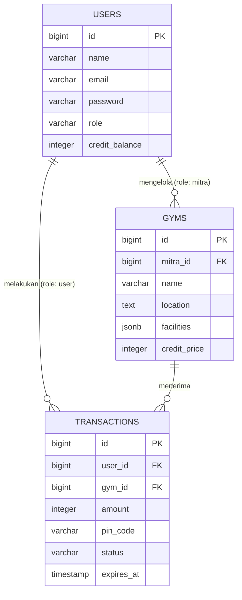

# PRODUCT REQUIREMENTS DOCUMENT (PRD) & DATABASE SCHEMA
**Project:** Multi-Gym Access Platform (MVP)
**Timeline:** 12 Hari

## PART 1: PRODUCT REQUIREMENTS DOCUMENT (PRD)

### 1. Problem Statement
Akses kebugaran saat ini terfragmentasi. Profesional nomaden terpaksa membayar keanggotaan penuh di satu lokasi, membuang nilai finansial secara sia-sia saat harus bepergian. Di sisi lain, mitra gym kehilangan pangsa pasar potensial karena tidak terhubung dalam satu infrastruktur akses digital terpusat.

### 2. Goals
*   **Business Goal:** Memvalidasi unit economics dari model akses lintas-gym (pay-per-visit) dan membuktikan bahwa skema ekosistem ini menghasilkan margin yang sehat bagi seluruh pihak.
*   **Product Goal:** Menyelesaikan peluncuran Minimum Viable Product berbasis web dalam jendela waktu 12 hari yang mampu mengorkestrasi autentikasi 3 entitas serta memproses transaksi internal secara akurat.

### 3. Target Users
1.  **User (Member):** Profesional yang berpindah-pindah lokasi dan menginginkan fleksibilitas akses gym menggunakan kuota kredit.
2.  **Mitra (Gym Partner):** Pemilik/Resepsionis gym independen yang ingin mendapatkan traffic pelanggan tambahan dan mencatat pendapatan per kedatangan (pay-per-visit).
3.  **Admin (Platform Owner):** Pengelola platform yang mengatur harga kredit, mendaftarkan Mitra, dan memantau transaksi.

### 4. User Stories
*   **Sebagai User**, saya ingin melihat daftar gym beserta harga kredit per kunjungannya, sehingga saya bisa memilih gym yang sesuai dengan saldo dan lokasi saya.
*   **Sebagai User**, saya ingin melakukan check-in dan mendapatkan Kode PIN 4-digit, sehingga saya bisa masuk ke gym tanpa kartu member fisik.
*   **Sebagai Mitra**, saya ingin memiliki dashboard untuk memasukkan Kode PIN user, sehingga saya bisa memvalidasi kedatangan mereka dan memastikan gym saya dibayar.
*   **Sebagai Admin**, saya ingin bisa menambahkan data Mitra gym baru dan menentukan tarif kredit mereka, sehingga jaringan gym di platform terus bertambah.

### 5. Functional Requirements
*   **Sistem Autentikasi (Role-Based):** Login/Register terpusat yang mengarahkan pengguna ke dashboard yang berbeda berdasarkan role (Admin, Mitra, User).
*   **Manajemen Gym (Admin):** CRUD (Create, Read, Update, Delete) data Mitra gym (Nama, Lokasi, Fasilitas, Harga Kredit per Visit).
*   **Katalog Gym (User):** Halaman list gym yang menampilkan detail gym dan tombol "Check-in".
*   **Sistem Check-in (User):** Tombol check-in yang memunculkan konfirmasi pemotongan kredit dan menghasilkan PIN Unik (contoh: 8492).
*   **Validasi PIN (Mitra):** Form input sederhana di dashboard Mitra untuk memasukkan PIN user.
*   **Sistem Saldo (All Roles):** Tampilan sisa kredit (User), histori kredit terpotong (User), dan histori kunjungan tervalidasi (Mitra).

### 6. Non-Functional Requirements
*   **Security:** Mengimplementasikan tenggat kedaluwarsa sistematis (Time-To-Live) pada PIN check-in serta memastikan tidak ada celah eksploitasi otorisasi antar peran.
*   **Usability:** Merancang tata letak antarmuka dengan prinsip mobile-first design untuk memastikan pengguna dapat menyelesaikan proses pemilihan lokasi hingga terbitnya kode akses tanpa hambatan visual.
*   **Performance:** Menjaga waktu respons interaksi server, khususnya untuk generate dan validasi PIN, agar selalu berada di bawah 3 detik demi mencegah antrean di area masuk.

### 7. Scope (Batasan 12 Hari)
*   **In-Scope:** 3 Role authentication, manajemen data gym, dompet kredit internal, generate & validasi PIN, histori transaksi.
*   **Out-of-Scope (Ditunda):** Integrasi payment gateway asli (saldo kredit user bisa di-top-up manual oleh Admin untuk MVP), aplikasi mobile native/cross-platform, fitur scanner barcode, algoritma rekomendasi gym berbasis AI.

---

## PART 2: TAMBAHAN ARSITEKTUR & LOGIKA (EXTENDED PRD)

### 1. Multi-Gym User Flow MVP (Check-in & Validation)
**Fase User:**
1. Pengguna mengeksplorasi direktori jaringan yang menampilkan berbagai pilihan, misalnya "Gym Alpha" dengan tarif 5 kredit dan "Studio Beta" dengan tarif 8 kredit.
2. Pengguna memilih fasilitas yang paling sesuai dengan kebutuhan mereka hari itu, menyetujui peringatan pemotongan saldo, dan langsung menerima PIN unik (Status transaksi di database: `PENDING`).

**Fase Mitra:**
3. Pihak resepsionis dari fasilitas kebugaran mana pun yang dituju oleh pengguna menginput PIN tersebut ke dalam sistem (dashboard Mitra).
4. Sistem mencocokkan PIN. Jika benar, status transaksi berubah menjadi `COMPLETED`.
5. Saldo kredit user resmi terpotong, dan dasbor Mitra menampilkan notifikasi sukses kunjungan.

### 2. Credit System Logic
Untuk menjaga agar data uang dan kunjungan tidak berantakan, gunakan pendekatan **Ledger / Jurnal Transaksi**:
*   Kredit **tidak dipotong** saat user baru menekan tombol "Check-in" (hanya mengunci/mencadangkan saldo).
*   Kredit **baru dipotong** secara permanen tepat ketika Mitra berhasil memasukkan PIN (Validasi sukses).
*   Jika PIN tidak divalidasi oleh Mitra dalam batas waktu tertentu (misalnya 2 jam), status transaksi otomatis `EXPIRED` dan saldo tidak jadi terpotong. Ini mencegah kerugian user jika ia tidak jadi datang setelah iseng menekan tombol check-in.

### 3. Technical Architecture
*   **Framework & Backend:** Laravel 11. Ekosistem ini menyediakan scaffolding otentikasi (seperti Laravel Breeze/Jetstream) yang memungkinkan Anda mengatur 3 role (Admin, Mitra, User) dengan cepat.
*   **Database:** PostgreSQL. Sangat tangguh dalam menangani relasi data yang ketat, terutama untuk tabel mutasi kredit/transaksi (ACID compliance sangat penting agar tidak ada kredit yang minus atau double-spend).
*   **Frontend / UI:** Blade templating bawaan Laravel dipadukan dengan TailwindCSS atau Bootstrap. 

---

## PART 3: SCHEMA DATABASE RELASIONAL

### 1. Entity Relationship Diagram (ERD)



### 2. Spesifikasi Tabel dan SQL (PostgreSQL Dialect)

#### A. Tabel `users`
Tabel ini bertindak sebagai sentral autentikasi terpusat untuk 3 role (Admin, Mitra, User). Tabel ini juga berfungsi sebagai dompet utama yang menyimpan saldo kredit pengguna.

```sql
CREATE TABLE users (
    id BIGSERIAL PRIMARY KEY,
    name VARCHAR(255) NOT NULL,
    email VARCHAR(255) UNIQUE NOT NULL,
    password VARCHAR(255) NOT NULL,
    role VARCHAR(50) NOT NULL DEFAULT 'user', -- Nilai: 'admin', 'mitra', 'user'
    credit_balance INT NOT NULL DEFAULT 0, -- Saldo kredit user
    created_at TIMESTAMP DEFAULT CURRENT_TIMESTAMP,
    updated_at TIMESTAMP DEFAULT CURRENT_TIMESTAMP
);

-- Indeks untuk mempercepat proses login dan filter berdasarkan role
CREATE INDEX idx_users_email ON users(email);
CREATE INDEX idx_users_role ON users(role);
```

#### B. Tabel `gyms`
Tabel ini menyimpan data katalog mitra gym, termasuk informasi harga kredit per kedatangan (pay-per-visit). Relasinya adalah One-to-Many dengan `users` (Satu Mitra bisa saja mengelola lebih dari satu cabang gym).

```sql
CREATE TABLE gyms (
    id BIGSERIAL PRIMARY KEY,
    mitra_id BIGINT NOT NULL, -- FK ke users.id (role: mitra)
    name VARCHAR(255) NOT NULL,
    location TEXT NOT NULL,
    facilities JSONB, -- Menyimpan array fasilitas (misal: ["Cardio", "Pool"])
    credit_price INT NOT NULL DEFAULT 0, -- Harga check-in
    created_at TIMESTAMP DEFAULT CURRENT_TIMESTAMP,
    updated_at TIMESTAMP DEFAULT CURRENT_TIMESTAMP,
    
    CONSTRAINT fk_gyms_mitra 
        FOREIGN KEY (mitra_id) 
        REFERENCES users(id) 
        ON DELETE CASCADE
);

-- Indeks untuk mempercepat pencarian gym di sisi user
CREATE INDEX idx_gyms_mitra_id ON gyms(mitra_id);
```

#### C. Tabel `transactions`
Tabel ini adalah jantung dari sistem Ledger (Jurnal Transaksi). Tabel ini mencatat pergerakan check-in, menyimpan PIN otorisasi, dan memegang status keamanan (Time-To-Live) agar tidak terjadi eksploitasi.

```sql
CREATE TABLE transactions (
    id BIGSERIAL PRIMARY KEY,
    user_id BIGINT NOT NULL, -- FK ke users.id
    gym_id BIGINT NOT NULL, -- FK ke gyms.id
    amount INT NOT NULL, -- Jumlah kredit yang dipotong
    pin_code VARCHAR(10) NOT NULL, -- PIN unik (misal: 4829)
    status VARCHAR(20) NOT NULL DEFAULT 'pending', -- Nilai: 'pending', 'completed', 'expired'
    expires_at TIMESTAMP NOT NULL, -- Batas waktu PIN valid
    created_at TIMESTAMP DEFAULT CURRENT_TIMESTAMP,
    updated_at TIMESTAMP DEFAULT CURRENT_TIMESTAMP,
    
    CONSTRAINT fk_transactions_user 
        FOREIGN KEY (user_id) 
        REFERENCES users(id) 
        ON DELETE CASCADE,
        
    CONSTRAINT fk_transactions_gym 
        FOREIGN KEY (gym_id) 
        REFERENCES gyms(id) 
        ON DELETE CASCADE
);

-- Indeks komposit dan single untuk optimasi validasi PIN dan query histori
CREATE INDEX idx_transactions_user_id ON transactions(user_id);
CREATE INDEX idx_transactions_gym_id ON transactions(gym_id);
CREATE INDEX idx_transactions_pin_status ON transactions(pin_code, status);
```

### 3. Penjelasan Logika Relasional & Implementasi MVP

*   **Keamanan PIN & Kedaluwarsa:** Kolom `expires_at` di tabel `transactions` akan diisi secara otomatis oleh backend (misalnya `now() + 2 hours`) saat user menekan tombol check-in. Jika waktu saat ini melebihi `expires_at`, validasi otomatis ditolak dan status transaksi berubah menjadi `expired`.
*   **ACID Transaction Lifecycle:** Saat resepsionis Mitra memasukkan PIN untuk memvalidasi, proses ini harus dibungkus dalam Database Transaction (misal: `DB::transaction()` di Laravel). Pastikan pemotongan `credit_balance` di tabel `users` dan perubahan `status` menjadi `completed` di tabel `transactions` terjadi di satu query block yang sama untuk mencegah terjadinya double-spend.
*   **Fleksibilitas Fasilitas:** Menggunakan tipe data `JSONB` pada kolom `facilities` di tabel `gyms` memungkinkan platform menyimpan tag fasilitas dengan mudah tanpa harus membuat tabel many-to-many baru, sangat menghemat waktu eksekusi dalam tenggat 12 hari ini.
